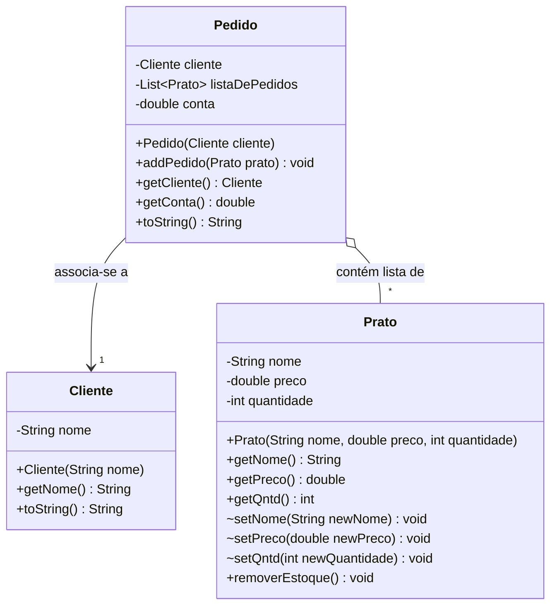

# Sistema de Gerenciamento de Restaurante - TADS

Sistema desenvolvido em Java para gerenciamento básico de um restaurante via terminal (console). O projeto permite cadastrar clientes, controlar o cardápio, realizar pedidos e monitorar o fluxo de caixa.

## Funcionalidades

* **Cadastrar Cliente:** Registro simples de clientes por nome.
* **Gestão de Cardápio:** Visualização e cadastro de novos pratos com preço e quantidade em estoque.
* **Pedidos:** Abertura de pedidos vinculados a um cliente, com verificação de estoque e soma automática dos valores.
* **Caixa:** Exibição do valor total acumulado das vendas.
* **Relatórios:** Listagem de todos os clientes e consulta de pedidos por cliente.

## Estrutura do Projeto

O código está organizado em pacotes. A estrutura de pastas deve seguir este padrão:

```
src/
├── restaurante/
│   └── Main.java
└── classes/
    ├── Cliente.java
    ├── Pedido.java
    └── Prato.java
```

## Requisitos

* Java JDK 8 ou superior.

## Como Compilar e Executar

Abra o terminal na pasta raiz do projeto (`src`) e execute os comandos abaixo:

1. **Compilar:**
   ```bash
   javac restaurante/Main.java
   ```

## Diagrama UML


